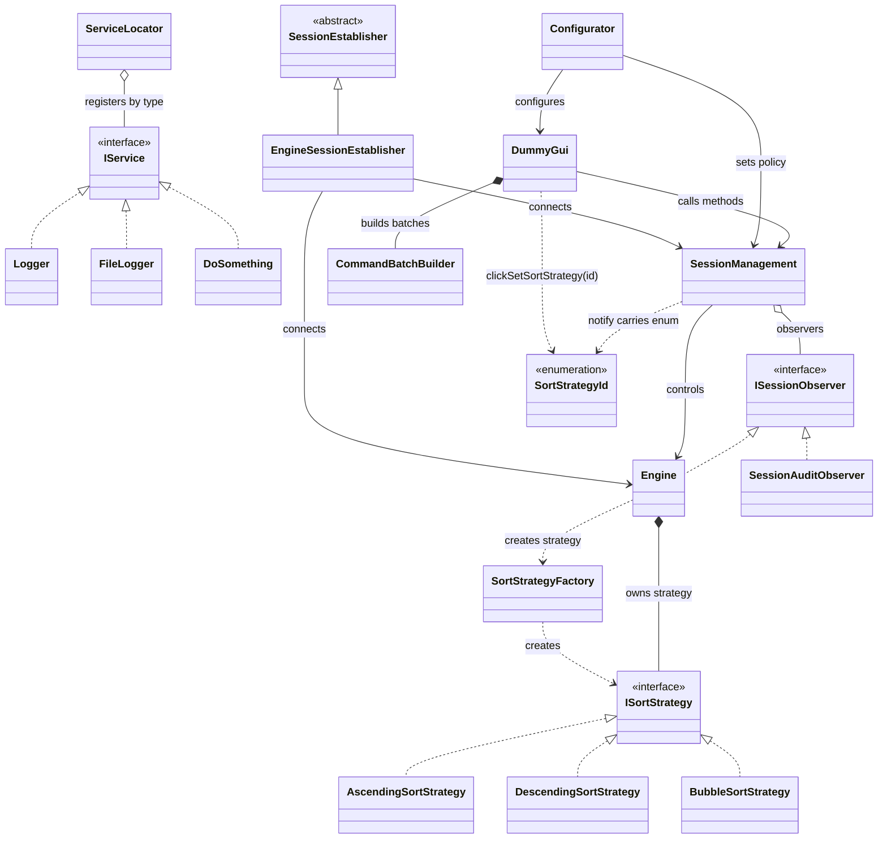

# UML Class Diagram — relationships between classes

The diagram shows **static** relationships (how classes are connected in the
code), as opposed to sequence diagrams, which show the concrete call flow over
time.

The block below is [mermaid.js](https://mermaid.js.org/) code — it renders
automatically as a diagram in GitHub, GitLab, Obsidian, VS Code (with the
Markdown Preview Mermaid Support extension) and many other Markdown preview
tools. If your preview does not render it, the source code below still
clearly describes all the relationships.

## Colour groups

- **purple** — interfaces / abstract classes (`IService`, `ISessionObserver`, `ISortStrategy`, `SessionEstablisher`)
- **green** — services registered in `ServiceLocator` (`Logger`, `FileLogger`, `DoSomething`, `ServiceLocator` itself)
- **coral** — session logic core (`Engine`, `SessionManagement`, `SessionAuditObserver`, `EngineSessionEstablisher`)
- **yellow** — GUI, configuration, concrete strategies (`DummyGui`, `Configurator`, `CommandBatchBuilder`, the three strategy classes)
- **orange** — latest additions (`SortStrategyFactory`, `SortStrategyId`)

## UML notation legend

| Symbol | Name | Meaning | Code example |
|---|---|---|---|
| `▷──` (solid line, open triangle) | Generalisation (inheritance) | Derived class inherits implementation from base class | `EngineSessionEstablisher : public SessionEstablisher` |
| `▷┄┄` (dashed line, open triangle) | Realisation (interface implementation) | Class implements a pure-abstract interface | `class Engine : public ISessionObserver` |
| `◆──` (filled diamond) | Composition | Strong ownership — the part cannot exist without the whole (`unique_ptr`, value member) | `Engine` owns `unique_ptr<ISortStrategy>` |
| `◇──` (open diamond) | Aggregation | Weak ownership — the part can exist independently of the whole (raw pointer, `shared_ptr`) | `SessionManagement` holds `vector<ISessionObserver*>` |
| `──>` (plain arrow, solid line) | Association | One class permanently knows / controls another | `SessionManagement --> Engine` |
| `┄┄>` (plain arrow, dashed line) | Dependency | One class uses another incidentally (a single call), without holding a reference | `Engine ..> SortStrategyFactory` |

## Where each relationship comes from in the code

- `IService <|.. Logger/FileLogger/DoSomething` — all three inherit from `IService` (interface realisation), which allows `ServiceLocator` to hold them in a single heterogeneous collection.
- `ServiceLocator o-- IService` — `ServiceLocator` holds `unordered_map<type_index, shared_ptr<IService>>`; this is aggregation because `shared_ptr` means shared, not exclusive, ownership.
- `ISessionObserver <|.. Engine/SessionAuditObserver` — both classes implement `onSessionEvent()`.
- `SessionManagement o-- ISessionObserver` — the observer list uses raw pointers (`vector<ISessionObserver*>`), hence aggregation, not composition.
- `Engine *-- ISortStrategy` — `Engine` holds `unique_ptr<ISortStrategy>`, i.e. exclusive ownership — composition.
- `Engine ..> SortStrategyFactory` and `SortStrategyFactory ..> ISortStrategy` — the factory is called as a static method; nobody stores it as a field — dependency, not association.
- `DummyGui *-- CommandBatchBuilder` — value member (not a pointer), therefore composition.
- `DummyGui/SessionManagement ..> SortStrategyId` — both classes accept this enum as a method parameter but do not store it — dependency.
