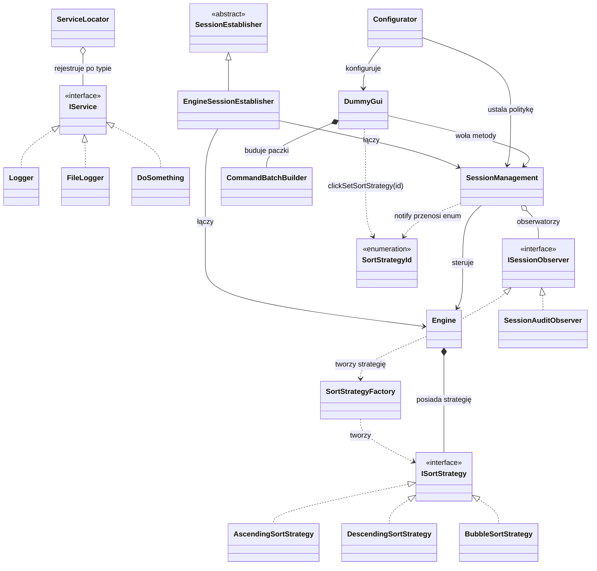

# Diagram klas UML — relacje między klasami

Diagram pokazuje relacje **statyczne** (jak klasy są ze sobą powiązane
w kodzie), w odróżnieniu od diagramów sekwencji, które pokazują konkretny
przepływ wywołań w czasie.

Blok poniżej to kod [mermaid.js](https://mermaid.js.org/) — renderuje się
automatycznie jako diagram w GitHub, GitLab, Obsidian, VS Code (z wtyczką
Markdown Preview Mermaid Support) i wielu innych narzędziach do podglądu
markdown. Jeśli Twój podgląd tego nie renderuje, kod źródłowy poniżej
nadal czytelnie opisuje wszystkie relacje.

## Grupy kolorystyczne

- **fioletowy** — interfejsy/klasy abstrakcyjne (`IService`, `ISessionObserver`, `ISortStrategy`, `SessionEstablisher`)
- **zielony** — usługi rejestrowane w `ServiceLocator` (`Logger`, `FileLogger`, `DoSomething`, sam `ServiceLocator`)
- **koralowy** — rdzeń logiki sesji (`Engine`, `SessionManagement`, `SessionAuditObserver`, `EngineSessionEstablisher`)
- **żółty** — GUI, konfiguracja, strategie konkretne (`DummyGui`, `Configurator`, `CommandBatchBuilder`, trzy klasy strategii)
- **pomarańczowy** — najnowsze dodatki (`SortStrategyFactory`, `SortStrategyId`)

## Legenda notacji UML

| Symbol | Nazwa | Znaczenie | Przykład w kodzie |
|---|---|---|---|
| `▷──` (linia ciągła, pusty trójkąt) | Generalizacja (dziedziczenie) | Klasa pochodna dziedziczy implementację po klasie bazowej | `EngineSessionEstablisher : public SessionEstablisher` |
| `▷┄┄` (linia przerywana, pusty trójkąt) | Realizacja (implementacja interfejsu) | Klasa implementuje czysto abstrakcyjny interfejs | `class Engine : public ISessionObserver` |
| `◆──` (pełny romb) | Kompozycja | Silne posiadanie — część nie istnieje bez całości (`unique_ptr`, pole wartościowe) | `Engine` posiada `unique_ptr<ISortStrategy>` |
| `◇──` (pusty romb) | Agregacja | Słabe posiadanie — część może istnieć niezależnie od całości (surowy wskaźnik, `shared_ptr`) | `SessionManagement` trzyma `vector<ISessionObserver*>` |
| `──>` (zwykła strzałka, linia ciągła) | Asocjacja | Jedna klasa trwale zna/steruje drugą | `SessionManagement --> Engine` |
| `┄┄>` (zwykła strzałka, linia przerywana) | Zależność | Jedna klasa używa drugiej doraźnie (jedno wywołanie), bez trzymania referencji | `Engine ..> SortStrategyFactory` |

## Skąd bierze się każda relacja w kodzie

- `IService <|.. Logger/FileLogger/DoSomething` — wszystkie trzy dziedziczą po `IService` (realizacja interfejsu), co pozwala `ServiceLocator` trzymać je w jednej, heterogenicznej kolekcji.
- `ServiceLocator o-- IService` — `ServiceLocator` trzyma `unordered_map<type_index, shared_ptr<IService>>`; to agregacja, bo `shared_ptr` oznacza współdzieloną, a nie wyłączną własność.
- `ISessionObserver <|.. Engine/SessionAuditObserver` — obie klasy implementują `onSessionEvent()`.
- `SessionManagement o-- ISessionObserver` — lista obserwatorów to surowe wskaźniki (`vector<ISessionObserver*>`), stąd agregacja, nie kompozycja.
- `Engine *-- ISortStrategy` — `Engine` trzyma `unique_ptr<ISortStrategy>`, czyli wyłączną własność — kompozycja.
- `Engine ..> SortStrategyFactory` i `SortStrategyFactory ..> ISortStrategy` — fabryka jest wołana metodą statyczną, nikt jej nie przechowuje jako pola — to zależność, nie asocjacja.
- `DummyGui *-- CommandBatchBuilder` — pole wartościowe (nie wskaźnik), więc kompozycja.
- `DummyGui/SessionManagement ..> SortStrategyId` — obie klasy przyjmują ten enum jako parametr metody, ale go nie przechowują — zależność.
