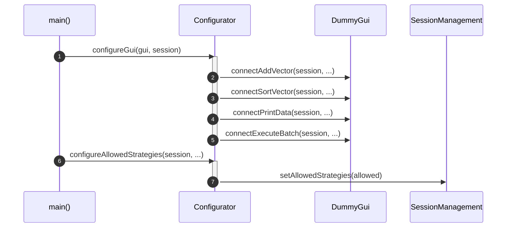
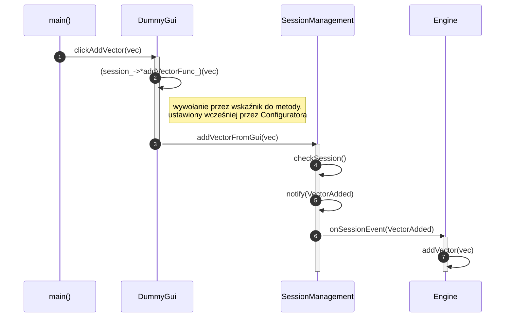
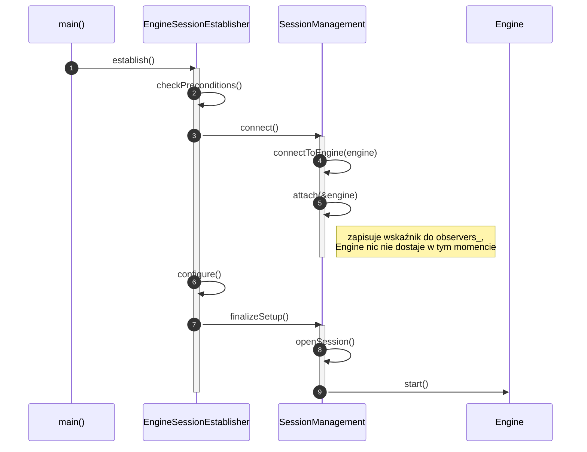
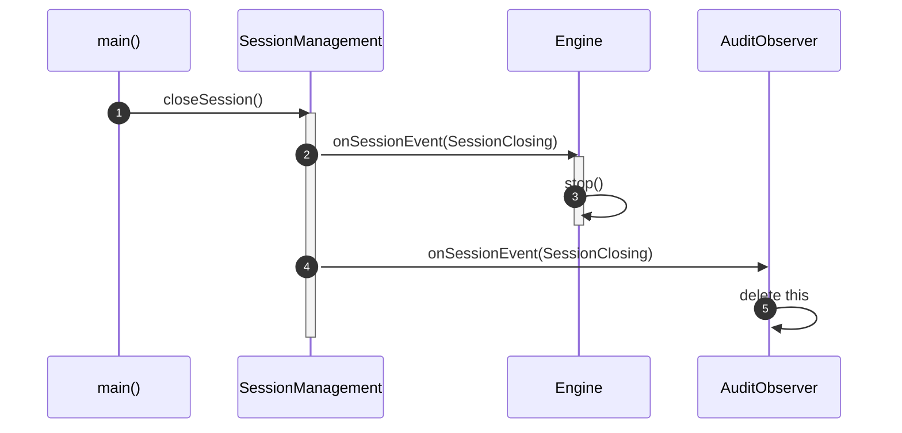
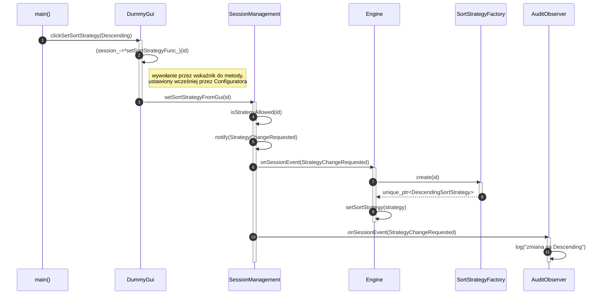
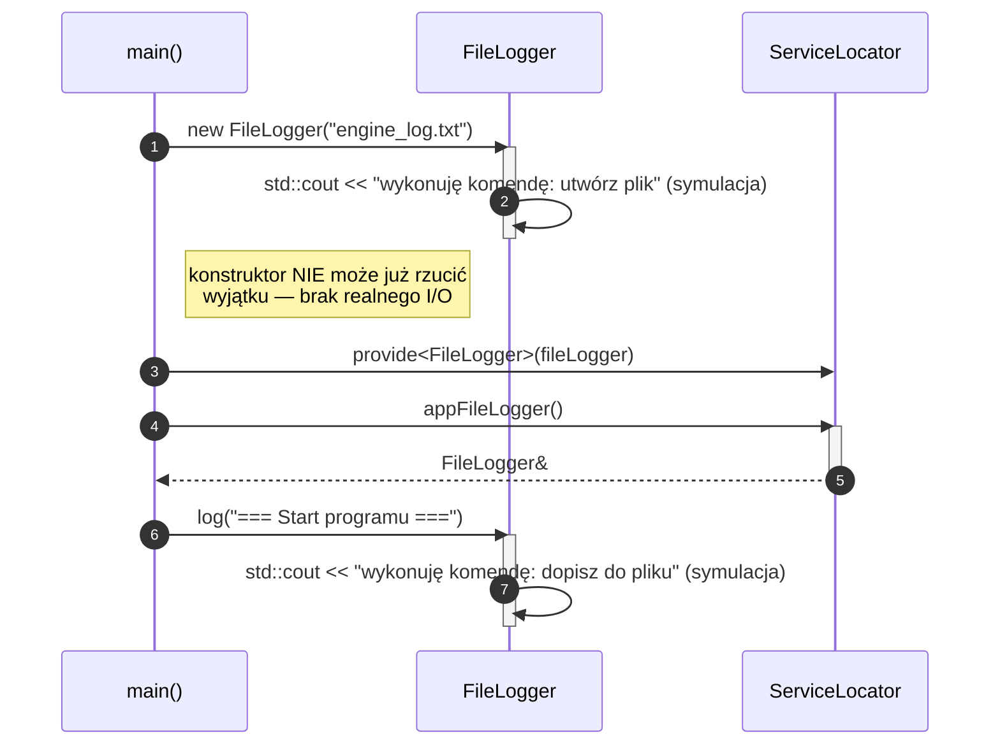

# Diagramy sekwencji UML — cykl życia programu

Sześć diagramów pokazujących konkretne, chronologicznie uporządkowane
scenariusze w programie. W odróżnieniu od diagramu klas (który pokazuje
statyczną strukturę), każdy z tych diagramów dotyczy **jednego konkretnego
przebiegu w czasie** — dlatego żaden pojedynczy diagram nie pokazuje
wszystkich klas naraz, tylko te, które faktycznie ze sobą rozmawiają
w danym scenariuszu.

Bloki poniżej to kod [mermaid.js](https://mermaid.js.org/) — renderuje się
automatycznie w GitHub, GitLab, Obsidian i VS Code (z wtyczką Markdown
Preview Mermaid Support).

---

## 1. Konfiguracja GUI na starcie programu

`Configurator` okablowuje `DummyGui` do `SessionManagement` (pięć wskaźników
do metod) i ustala politykę dozwolonych strategii sortowania.

---

## 2. Kliknięcie w GUI: dodanie wektora

`main()` woła `DummyGui.clickAddVector()`, które przekazuje wywołanie dalej
**przez wskaźnik do metody** (ustawiony wcześniej przez Configuratora) —
dopiero to trafia do `SessionManagement`, które rozsyła zdarzenie do `Engine`.

---

## 3. Tworzenie sesji (`EngineSessionEstablisher.establish()`)

Template Method: stały szkielet (`checkPreconditions()` → `connect()` →
`configure()` → `finalizeSetup()`). Zwróć uwagę na `attach(&engine)` —
to samowywołanie na `SessionManagement`, nie wiadomość do `Engine`
(które w tym momencie nic nie dostaje, tylko zostaje zapamiętane).

---

## 4. Zamykanie sesji

`SessionManagement` rozsyła `SessionClosing` do obu obserwatorów.
`AuditObserver` w reakcji sam się niszczy (`delete this`) — stąd znaczek
**X** na jego linii życia, dokładnie jak przy zniszczeniu obiektu w
klasycznej notacji UML.

---

## 5. Zmiana strategii sortowania

Przepływ przez `DummyGui` → `SessionManagement` → `notify()` (Observer) →
`Engine`, który **sam** woła `SortStrategyFactory`, żeby zbudować nową
strategię. `AuditObserver` dostaje to samo zdarzenie równolegle —
dzięki temu audyt faktycznie widzi żądania zmiany strategii.

---

## 6. Start programu: rejestracja usług i symulowany `FileLogger`

`FileLogger` niczego realnie nie zapisuje na dysk — tylko wypisuje na
konsolę, jaką komendę by wykonał. Dzięki temu jego konstruktor **nie może
rzucić wyjątku** — nie ma żadnej operacji I/O, która mogłaby się nie udać.

---

## Legenda notacji UML (diagram sekwencji)

| Element | Znaczenie |
|---|---|
| Pionowa przerywana linia | Linia życia obiektu (od utworzenia do zniszczenia) |
| Wąski prostokąt na linii życia | Pasek aktywacji — obiekt aktualnie wykonuje pracę |
| `A->>B: wiadomość` | Wywołanie synchroniczne z A do B |
| `A-->>B: wiadomość` | Zwrot wartości (odpowiedź) z A do B |
| `A->>A: wiadomość` | Samowywołanie — metoda wołana bez kwalifikatora obiektu (`this->metoda()`) |
| Numer w kółku | Kolejność zdarzeń w czasie (`autonumber`) |
| **X** na końcu linii życia | Zniszczenie obiektu (`destroy`) |
| `Note right of X: ...` | Adnotacja wyjaśniająca, niebędąca sygnałem |
