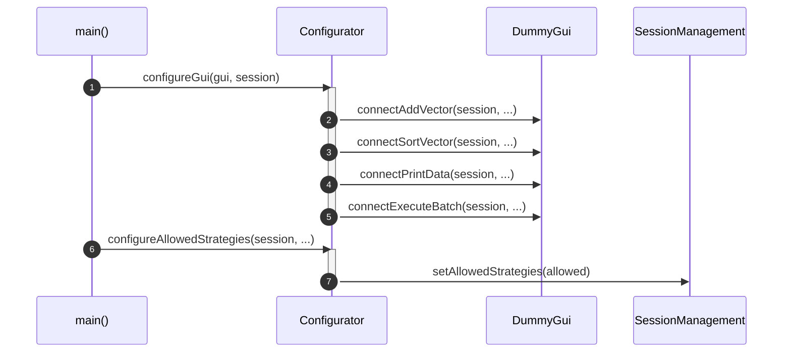
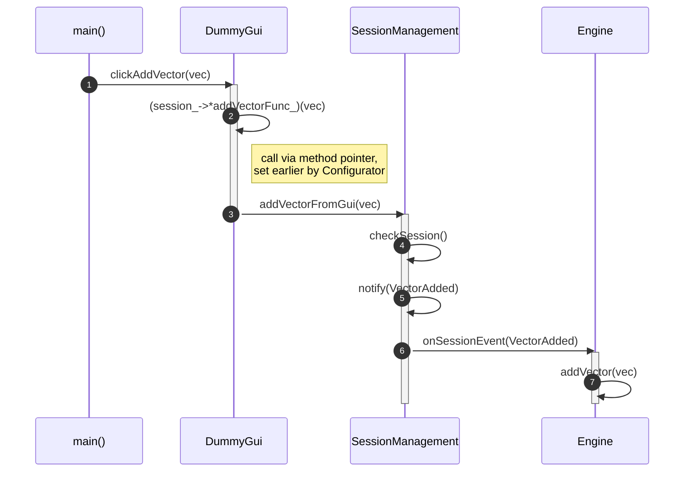
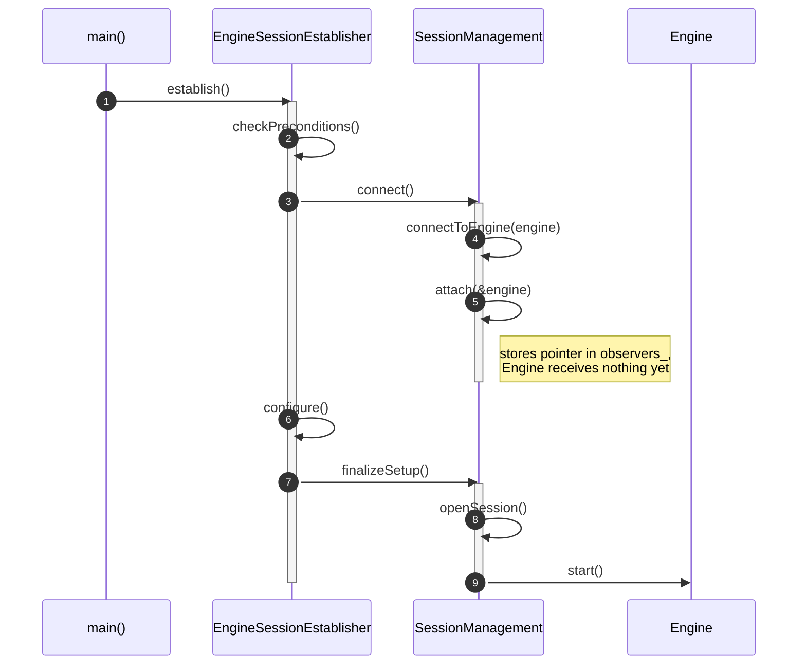
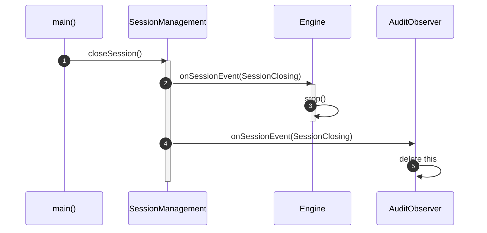
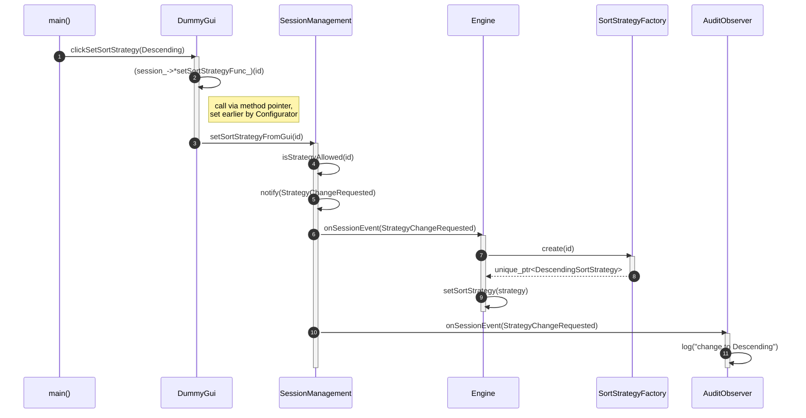
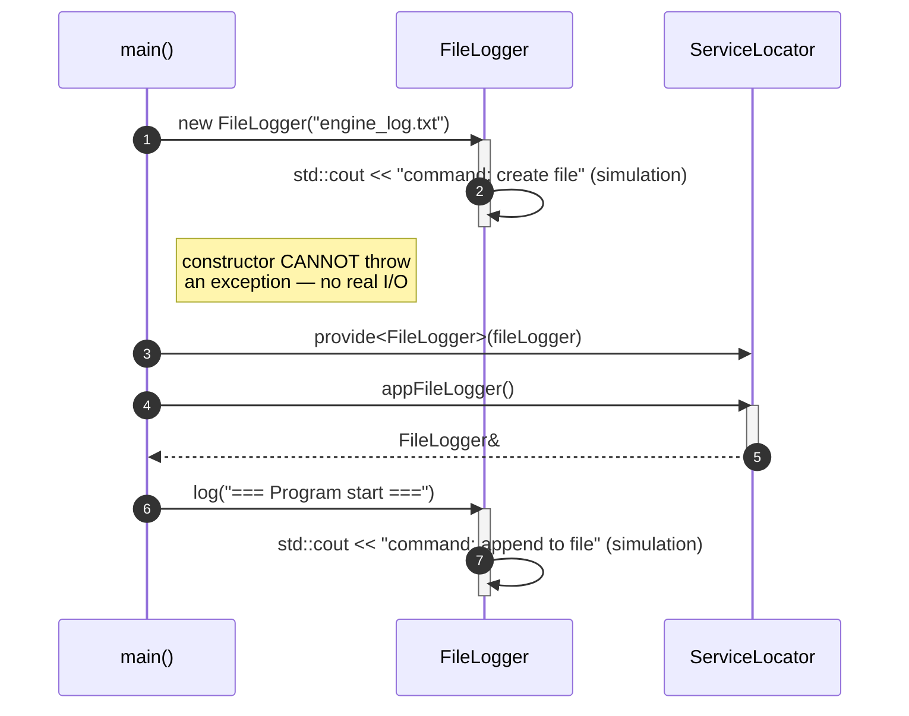

# UML Sequence Diagrams — program lifecycle

Six diagrams showing specific, chronologically ordered scenarios in the
program. Unlike the class diagram (which shows static structure), each of
these diagrams covers **one concrete execution flow over time** — which is
why no single diagram shows all classes at once, only those that actually
communicate with each other in a given scenario.

The blocks below are [mermaid.js](https://mermaid.js.org/) code — they render
automatically in GitHub, GitLab, Obsidian and VS Code (with the Markdown
Preview Mermaid Support extension).

---

## 1. GUI configuration at program startup

`Configurator` wires `DummyGui` to `SessionManagement` (five method pointers)
and sets the policy for allowed sort strategies.

---

## 2. GUI click: add vector

`main()` calls `DummyGui.clickAddVector()`, which forwards the call
**via a method pointer** (set earlier by Configurator) — only then does it
reach `SessionManagement`, which broadcasts the event to `Engine`.

---

## 3. Session creation (`EngineSessionEstablisher.establish()`)

Template Method: fixed skeleton (`checkPreconditions()` → `connect()` →
`configure()` → `finalizeSetup()`). Note the `attach(&engine)` — it is a
self-call on `SessionManagement`, not a message to `Engine` (which at this
point receives nothing, it is only stored for later).

---

## 4. Closing the session

`SessionManagement` broadcasts `SessionClosing` to both observers.
`AuditObserver` reacts by destroying itself (`delete this`) — hence the
**X** on its lifeline, exactly as in the classic UML destruction notation.

---

## 5. Changing the sort strategy

Flow through `DummyGui` → `SessionManagement` → `notify()` (Observer) →
`Engine`, which **itself** calls `SortStrategyFactory` to build the new
strategy. `AuditObserver` receives the same event in parallel — so the
audit genuinely sees strategy-change requests.

---

## 6. Program startup: service registration and simulated `FileLogger`

`FileLogger` does not actually write anything to disk — it only prints to
the console what command it would execute. This means its constructor
**cannot throw an exception** — there is no I/O operation that could fail.

---

## UML notation legend (sequence diagram)

| Element | Meaning |
|---|---|
| Vertical dashed line | Object lifeline (from creation to destruction) |
| Narrow rectangle on the lifeline | Activation bar — the object is currently doing work |
| `A->>B: message` | Synchronous call from A to B |
| `A-->>B: message` | Return value (response) from A to B |
| `A->>A: message` | Self-call — a method called without an object qualifier (`this->method()`) |
| Circled number | Order of events over time (`autonumber`) |
| **X** at the end of the lifeline | Object destruction (`destroy`) |
| `Note right of X: ...` | Explanatory annotation, not a signal |
