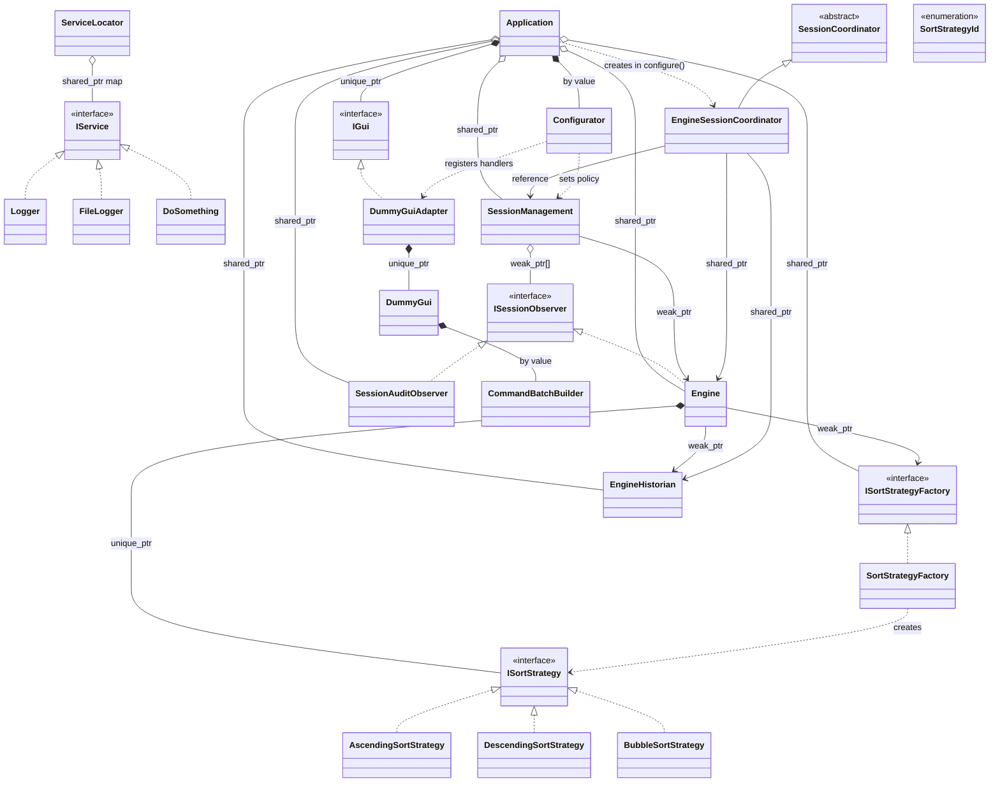

# UML Class Diagram — relationships between classes

The diagram shows **static** relationships (how classes are connected in the
code), as opposed to sequence diagrams, which show the concrete call flow over
time.

The block below is [mermaid.js](https://mermaid.js.org/) code — it renders
automatically as a diagram in GitHub, GitLab, Obsidian, VS Code (with the
Markdown Preview Mermaid Support extension) and many other Markdown preview
tools. If your preview does not render it, the source code below still
clearly describes all the relationships.



## Colour groups

- **blue** — `Application` — root of the object graph; owns all top-level objects
- **purple** — interfaces / abstract classes (`IService`, `ISessionObserver`, `ISortStrategy`, `ISortStrategyFactory`, `IGui`, `SessionCoordinator`)
- **green** — services registered in `ServiceLocator` (`Logger`, `FileLogger`, `DoSomething`, `ServiceLocator` itself)
- **coral** — session logic core (`Engine`, `EngineHistorian`, `SessionManagement`, `SessionAuditObserver`, `EngineSessionCoordinator`)
- **yellow** — GUI, configuration, concrete strategies (`DummyGui`, `DummyGuiAdapter`, `Configurator`, `CommandBatchBuilder`, the three strategy classes)
- **orange** — latest additions (`SortStrategyFactory`, `SortStrategyId`)

## UML notation legend

| Symbol | Name | Meaning | Code example |
|---|---|---|---|
| `▷──` (solid line, open triangle) | Generalisation (inheritance) | Derived class inherits implementation from base class | `EngineSessionCoordinator : public SessionCoordinator` |
| `▷┄┄` (dashed line, open triangle) | Realisation (interface implementation) | Class implements a pure-abstract interface | `class Engine : public ISessionObserver` |
| `◆──` (filled diamond) | Composition | Strong ownership — the part cannot exist without the whole (`unique_ptr`, value member) | `Application` owns `unique_ptr<IGui>` |
| `◇──` (open diamond) | Aggregation | Co-ownership — part can outlive the holder (`shared_ptr`) | `Application o-- Engine` (shared_ptr) |
| `──>` (plain arrow, solid line) | Association | One class permanently holds a (possibly weak) reference to another | `Engine --> EngineHistorian : weak_ptr` |
| `┄┄>` (plain arrow, dashed line) | Dependency | One class uses another locally (parameter, local variable) — no stored field | `Engine ..> ISortStrategyFactory (creates())` |

## Where each relationship comes from in the code

**Application ownership (Application.hpp / Application.cpp)**

```
unique_ptr<IGui>                   gui_          → composition  (exclusive ownership)
Configurator                       configurator_  → composition  (by value)
shared_ptr<Engine>                 engine_        → aggregation  (co-owns with coordinator)
shared_ptr<ISortStrategyFactory>   factory_       → aggregation  (keeps factory alive for Engine's weak_ptr)
shared_ptr<EngineHistorian>        historian_     → aggregation  (keeps historian alive for Engine's weak_ptr)
shared_ptr<SessionManagement>      session_       → aggregation
shared_ptr<SessionAuditObserver>   audit_         → aggregation  (observer lifetime independent of session)
EngineSessionCoordinator           (stack local)  → dependency   (created and destroyed in configure())
```

**Engine (Engine.hpp)**

```
unique_ptr<ISortStrategy>          sortStrategy_  → composition  (strategy swap replaces it)
weak_ptr<ISortStrategyFactory>     factory_       → association  (Application keeps it alive; Engine uses it per event)
weak_ptr<EngineHistorian>          historian_     → association  (Application keeps it alive; disableHistorian() lets it expire)
```

**SessionManagement (SessionManagement.hpp)**

```
weak_ptr<Engine>                   engine_        → association  (Engine owned by Application, not by Session)
vector<weak_ptr<ISessionObserver>> observers_     → aggregation  (expired observers pruned automatically)
```

**Adapter pattern (DummyGuiAdapter.hpp)**

```
DummyGuiAdapter implements IGui — Application sees only IGui
unique_ptr<DummyGui> gui_          → composition  (DummyGuiAdapter is sole owner; deleteGUI() called via default_delete)
CommandBatchBuilder  batchBuilder_ → composition  (value member in DummyGui)
```

**Template Method (SessionCoordinator.hpp)**

```
EngineSessionCoordinator holds:
  SessionManagement&                session_   → association (reference, not owned)
  shared_ptr<Engine>                engine_    → aggregation (co-owns during establish())
  shared_ptr<ISortStrategyFactory>  factory_   → aggregation (co-owns during establish())
  shared_ptr<EngineHistorian>       historian_ → aggregation (co-owns during establish(); enableHistorian() re-creates)
```
