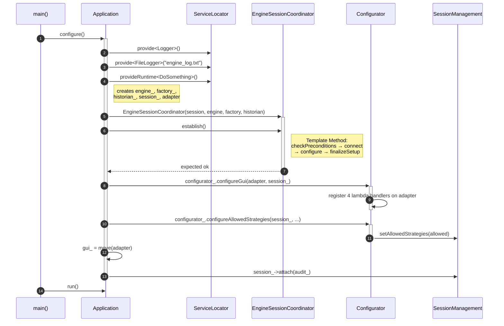
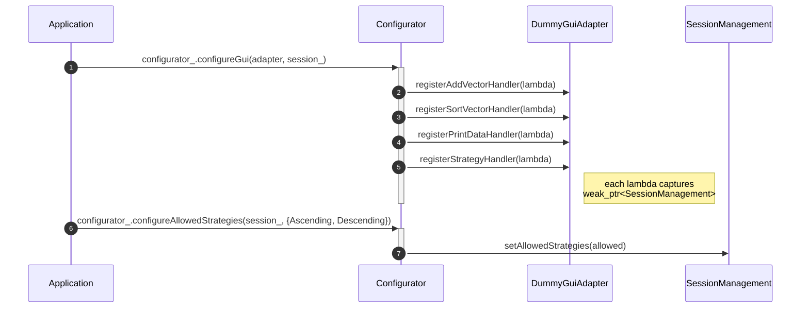
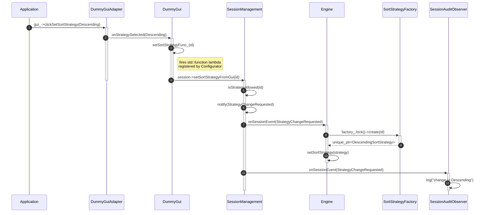

# UML Sequence Diagrams — program lifecycle

Six diagrams showing specific, chronologically ordered scenarios in the
program. Unlike the class diagram (which shows static structure), each of
these diagrams covers **one concrete execution flow over time** — which is
why no single diagram shows all classes at once, only those that actually
communicate with each other in a given scenario.

The blocks below are [mermaid.js](https://mermaid.js.org/) code — they render
automatically in GitHub, GitLab, Obsidian and VS Code (with the Markdown
Preview Mermaid Support extension).

---

## 1. `Application::configure()` — object creation and wiring

`main()` creates `Application` and calls `configure()`. Inside, Application
registers services in `ServiceLocator`, creates the full object graph, runs
`EngineSessionCoordinator::establish()` (Template Method), wires GUI callbacks
via `Configurator`, and attaches the `SessionAuditObserver`.



---

## 2. `establish()` detail — Template Method (session + engine wiring)

`EngineSessionCoordinator::establish()` calls four protected steps in a fixed
order. `connect()` registers Engine as a session observer. `configure()` pushes
the factory and historian into Engine (Engine stores both as `weak_ptr`).
`finalizeSetup()` opens the session and starts the engine.

```mermaid
sequenceDiagram
    autonumber
    participant App as Application
    participant Coord as EngineSessionCoordinator
    participant Session as SessionManagement
    participant Eng as Engine

    App->>+Coord: establish()
    Coord->>Coord: checkPreconditions()
    Coord->>+Session: connect()
    Session->>Session: connectToEngine(engine_)
    Session->>Session: attach(engine_)
    Note right of Session: Engine stored as weak_ptr<br/>in observers_ — receives nothing yet
    deactivate Session
    Coord->>Coord: configure()
    Coord->>Eng: engine_->setFactory(factory_)
    Coord->>Eng: engine_->setHistorian(historian_)
    Note right of Eng: Engine stores weak_ptr to both;<br/>Application's shared_ptr keeps them alive
    Coord->>+Session: finalizeSetup()
    Session->>Session: openSession()
    Session->>Eng: onSessionEvent(SessionOpened) → start()
    deactivate Session
    Coord-->>-App: expected ok
```

---

## 3. GUI wiring — Configurator registers lambda handlers

`Configurator::configureGui()` captures a `weak_ptr<SessionManagement>` in
each lambda and registers it on `DummyGuiAdapter`. The `weak_ptr` ensures the
lambda is safe to call even if the session is destroyed before the GUI.



---

## 4. `Application::run()` — GUI click: add vector

`Application::run()` calls `gui_->clickAddVector()` through the `IGui`
interface. `DummyGuiAdapter` (Adapter) translates it into `DummyGui`'s
vocabulary (`onAddVectorClicked`), which fires the registered lambda.
The lambda forwards the call to `SessionManagement`, which notifies `Engine`
via the Observer pattern.

```mermaid
sequenceDiagram
    autonumber
    participant App as Application
    participant Adapter as DummyGuiAdapter
    participant Gui as DummyGui
    participant Session as SessionManagement
    participant Eng as Engine

    App->>+Adapter: gui_->clickAddVector(vec)
    Note left of App: called via IGui interface;<br/>App does not see DummyGuiAdapter
    Adapter->>+Gui: onAddVectorClicked(vec)
    Gui->>Gui: addVectorFunc_(vec)
    Note right of Gui: fires std::function lambda<br/>registered by Configurator
    Gui->>Session: session->addVectorFromGui(vec)
    deactivate Gui
    deactivate Adapter
    activate Session
    Session->>Session: checkSession()
    Session->>Session: notify(VectorAdded)
    Session->>+Eng: onSessionEvent(VectorAdded)
    Eng->>Eng: addVector(vec)
    deactivate Eng
    deactivate Session
```

---

## 5. `Application::run()` — strategy change

`Application` requests a strategy change through `IGui`. The call flows through
the Adapter layer, fires a lambda into `SessionManagement`, which validates the
request and broadcasts it via Observer. `Engine` builds the new strategy using
`ISortStrategyFactory` (held as a `weak_ptr`). `SessionAuditObserver` receives
the same event in parallel.



---

## 6. `Application::run()` — closing the session

`Application` calls `session_->closeSession()` directly (not through the GUI).
`SessionManagement` broadcasts `SessionClosing` to all observers.
`SessionAuditObserver` logs the event and returns — it is owned by `Application`
as a `shared_ptr` and is destroyed only when `Application` itself goes out of
scope, not inside the observer callback.

```mermaid
sequenceDiagram
    autonumber
    participant App as Application
    participant Session as SessionManagement
    participant Eng as Engine
    participant Audit as SessionAuditObserver

    App->>+Session: session_->closeSession()
    Session->>+Eng: onSessionEvent(SessionClosing)
    Eng->>Eng: stop()
    deactivate Eng
    Session->>+Audit: onSessionEvent(SessionClosing)
    Audit->>Audit: log("session closed")
    deactivate Audit
    deactivate Session
    Note right of App: Application still holds shared_ptr<Audit>;<br/>Audit destroyed when Application is destroyed
```

---

## UML notation legend (sequence diagram)

| Element | Meaning |
|---|---|
| Vertical dashed line | Object lifeline (from creation to destruction) |
| Narrow rectangle on the lifeline | Activation bar — the object is currently doing work |
| `A->>B: message` | Synchronous call from A to B |
| `A-->>B: message` | Return value (response) from A to B |
| `A->>A: message` | Self-call — a method called without an object qualifier (`this->method()`) |
| Circled number | Order of events over time (`autonumber`) |
| **X** at the end of the lifeline | Object destruction (`destroy`) |
| `Note right of X: ...` | Explanatory annotation, not a signal |
