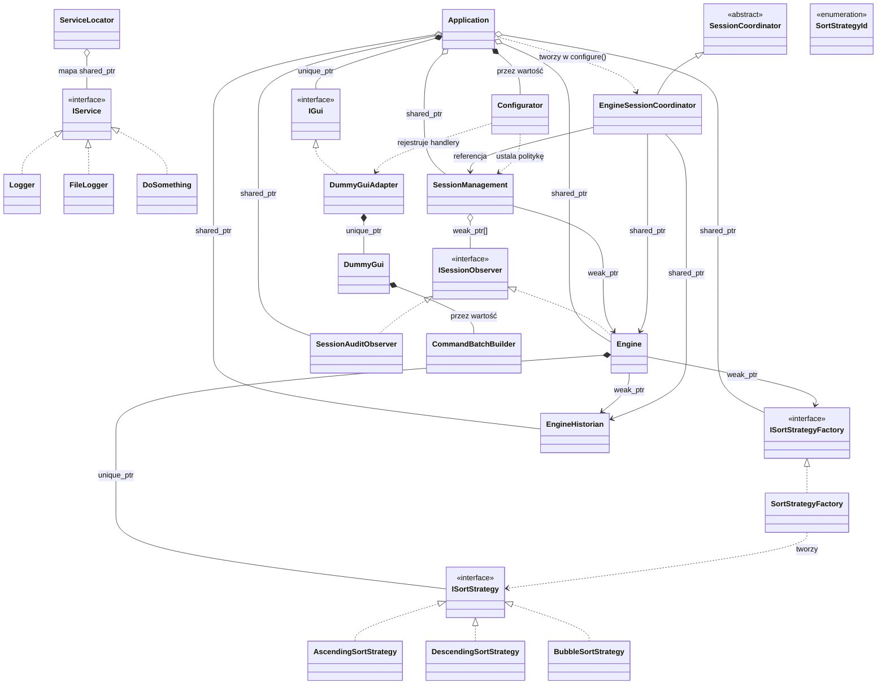

# Diagram klas UML — relacje między klasami

Diagram pokazuje relacje **statyczne** (jak klasy są ze sobą powiązane
w kodzie), w odróżnieniu od diagramów sekwencji, które pokazują konkretny
przepływ wywołań w czasie.

Blok poniżej to kod [mermaid.js](https://mermaid.js.org/) — renderuje się
automatycznie jako diagram w GitHub, GitLab, Obsidian, VS Code (z wtyczką
Markdown Preview Mermaid Support) i wielu innych narzędziach do podglądu
markdown. Jeśli Twój podgląd tego nie renderuje, kod źródłowy poniżej
nadal czytelnie opisuje wszystkie relacje.



## Grupy kolorystyczne

- **niebieski** — `Application` — korzeń grafu obiektów; właściciel wszystkich obiektów najwyższego poziomu
- **fioletowy** — interfejsy/klasy abstrakcyjne (`IService`, `ISessionObserver`, `ISortStrategy`, `ISortStrategyFactory`, `IGui`, `SessionCoordinator`)
- **zielony** — usługi rejestrowane w `ServiceLocator` (`Logger`, `FileLogger`, `DoSomething`, sam `ServiceLocator`)
- **koralowy** — rdzeń logiki sesji (`Engine`, `EngineHistorian`, `SessionManagement`, `SessionAuditObserver`, `EngineSessionCoordinator`)
- **żółty** — GUI, konfiguracja, strategie konkretne (`DummyGui`, `DummyGuiAdapter`, `Configurator`, `CommandBatchBuilder`, trzy klasy strategii)
- **pomarańczowy** — najnowsze dodatki (`SortStrategyFactory`, `SortStrategyId`)

## Legenda notacji UML

| Symbol | Nazwa | Znaczenie | Przykład w kodzie |
|---|---|---|---|
| `▷──` (linia ciągła, pusty trójkąt) | Generalizacja (dziedziczenie) | Klasa pochodna dziedziczy implementację po klasie bazowej | `EngineSessionCoordinator : public SessionCoordinator` |
| `▷┄┄` (linia przerywana, pusty trójkąt) | Realizacja (implementacja interfejsu) | Klasa implementuje czysto abstrakcyjny interfejs | `class Engine : public ISessionObserver` |
| `◆──` (pełny romb) | Kompozycja | Silne posiadanie — część nie istnieje bez całości (`unique_ptr`, pole wartościowe) | `Application` posiada `unique_ptr<IGui>` |
| `◇──` (pusty romb) | Agregacja | Współposiadanie — część może przeżyć właściciela (`shared_ptr`) | `Application o-- Engine` (shared_ptr) |
| `──>` (zwykła strzałka, linia ciągła) | Asocjacja | Jedna klasa trwale trzyma (ewentualnie słabą) referencję do drugiej | `Engine --> EngineHistorian : weak_ptr` |
| `┄┄>` (zwykła strzałka, linia przerywana) | Zależność | Jedna klasa używa drugiej lokalnie (parametr, zmienna lokalna) — bez pola składowego | `Configurator ..> DummyGuiAdapter` |

## Skąd bierze się każda relacja w kodzie

**Własności Application (Application.hpp / Application.cpp)**

```
unique_ptr<IGui>                   gui_          → kompozycja   (wyłączne posiadanie)
Configurator                       configurator_  → kompozycja   (pole wartościowe)
shared_ptr<Engine>                 engine_        → agregacja    (współposiada z koordynatorem)
shared_ptr<ISortStrategyFactory>   factory_       → agregacja    (utrzymuje factory żywą dla weak_ptr Engine)
shared_ptr<EngineHistorian>        historian_     → agregacja    (utrzymuje historiana żywego dla weak_ptr Engine)
shared_ptr<SessionManagement>      session_       → agregacja
shared_ptr<SessionAuditObserver>   audit_         → agregacja    (czas życia obserwatora niezależny od sesji)
EngineSessionCoordinator           (zmienna lokalna) → zależność (tworzony i niszczony w configure())
```

**Engine (Engine.hpp)**

```
unique_ptr<ISortStrategy>          sortStrategy_  → kompozycja  (zamiana strategii zastępuje stary obiekt)
weak_ptr<ISortStrategyFactory>     factory_       → asocjacja   (Application utrzymuje przy życiu; Engine używa per zdarzenie)
weak_ptr<EngineHistorian>          historian_     → asocjacja   (Application utrzymuje przy życiu; disableHistorian() wygasza weak_ptr)
```

**SessionManagement (SessionManagement.hpp)**

```
weak_ptr<Engine>                   engine_        → asocjacja   (Engine posiadany przez Application, nie przez sesję)
vector<weak_ptr<ISessionObserver>> observers_     → agregacja   (wygasłe obserwatory usuwane automatycznie)
```

**Wzorzec Adapter (DummyGuiAdapter.hpp)**

```
DummyGuiAdapter implementuje IGui — Application widzi tylko IGui
unique_ptr<DummyGui> gui_          → kompozycja  (jedyny właściciel; deleteGUI() przez default_delete)
CommandBatchBuilder  batchBuilder_ → kompozycja  (pole wartościowe w DummyGui)
```

**Metoda Szablonowa (SessionCoordinator.hpp)**

```
EngineSessionCoordinator posiada:
  SessionManagement&                session_   → asocjacja  (referencja, nie posiadanie)
  shared_ptr<Engine>                engine_    → agregacja  (współposiada podczas establish())
  shared_ptr<ISortStrategyFactory>  factory_   → agregacja  (współposiada podczas establish())
  shared_ptr<EngineHistorian>       historian_ → agregacja  (współposiada; enableHistorian() tworzy nowy)
```
