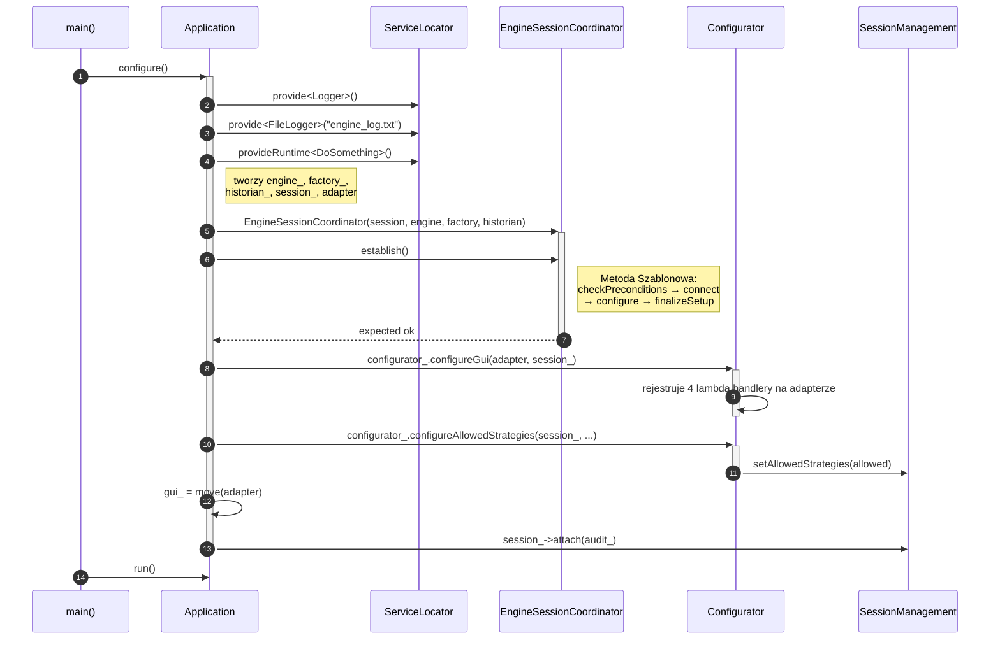
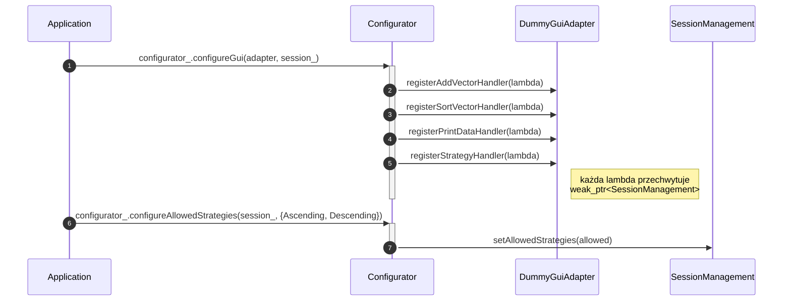
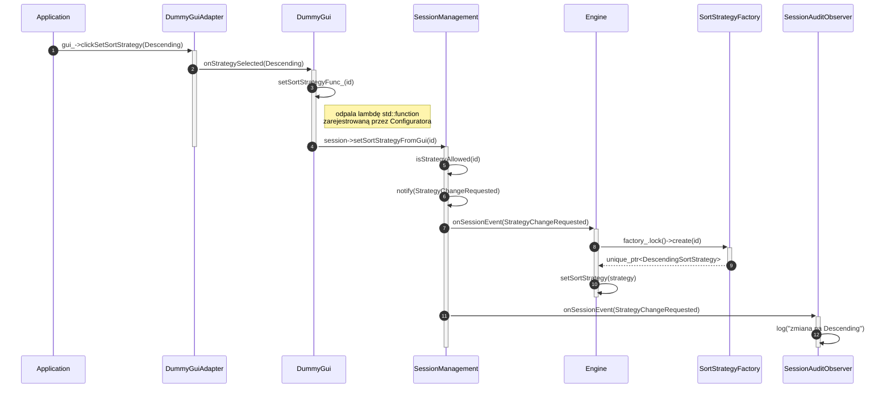

# Diagramy sekwencji UML — cykl życia programu

Sześć diagramów pokazujących konkretne, chronologicznie uporządkowane
scenariusze w programie. W odróżnieniu od diagramu klas (który pokazuje
statyczną strukturę), każdy z tych diagramów dotyczy **jednego konkretnego
przebiegu w czasie** — dlatego żaden pojedynczy diagram nie pokazuje
wszystkich klas naraz, tylko te, które faktycznie ze sobą rozmawiają
w danym scenariuszu.

Bloki poniżej to kod [mermaid.js](https://mermaid.js.org/) — renderuje się
automatycznie w GitHub, GitLab, Obsidian i VS Code (z wtyczką Markdown
Preview Mermaid Support).

---

## 1. `Application::configure()` — tworzenie obiektów i okablowanie

`main()` tworzy `Application` i woła `configure()`. Wewnątrz Application
rejestruje usługi w `ServiceLocator`, buduje pełny graf obiektów, uruchamia
`EngineSessionCoordinator::establish()` (Metoda Szablonowa), okablowuje
handlery GUI przez `Configurator` i podpina `SessionAuditObserver`.



---

## 2. Szczegół `establish()` — Metoda Szablonowa (okablowanie sesji i silnika)

`EngineSessionCoordinator::establish()` woła cztery chronione kroki w stałej
kolejności. `connect()` rejestruje Engine jako obserwatora sesji. `configure()`
przekazuje fabrykę i historiana do Engine (Engine przechowuje oba jako `weak_ptr`).
`finalizeSetup()` otwiera sesję i startuje silnik.

```mermaid
sequenceDiagram
    autonumber
    participant App as Application
    participant Coord as EngineSessionCoordinator
    participant Session as SessionManagement
    participant Eng as Engine

    App->>+Coord: establish()
    Coord->>Coord: checkPreconditions()
    Coord->>+Session: connect()
    Session->>Session: connectToEngine(engine_)
    Session->>Session: attach(engine_)
    Note right of Session: Engine zapisany jako weak_ptr<br/>w observers_ — nic nie dostaje w tej chwili
    deactivate Session
    Coord->>Coord: configure()
    Coord->>Eng: engine_->setFactory(factory_)
    Coord->>Eng: engine_->setHistorian(historian_)
    Note right of Eng: Engine trzyma weak_ptr do obu;<br/>shared_ptr Application utrzymuje je przy życiu
    Coord->>+Session: finalizeSetup()
    Session->>Session: openSession()
    Session->>Eng: onSessionEvent(SessionOpened) → start()
    deactivate Session
    Coord-->>-App: expected ok
```

---

## 3. Okablowanie GUI — Configurator rejestruje handlery lambda

`Configurator::configureGui()` przechwytuje `weak_ptr<SessionManagement>` w każdej
lambdzie i rejestruje ją na `DummyGuiAdapter`. `weak_ptr` gwarantuje, że wywołanie
lambdy jest bezpieczne nawet jeśli sesja zostanie zniszczona przed GUI.



---

## 4. `Application::run()` — kliknięcie w GUI: dodanie wektora

`Application::run()` woła `gui_->clickAddVector()` przez interfejs `IGui`.
`DummyGuiAdapter` (Adapter) tłumaczy wywołanie na słownictwo `DummyGui`
(`onAddVectorClicked`), które odpala zarejestrowaną lambdę. Lambda przekazuje
wywołanie do `SessionManagement`, które powiadamia `Engine` przez wzorzec Observer.

```mermaid
sequenceDiagram
    autonumber
    participant App as Application
    participant Adapter as DummyGuiAdapter
    participant Gui as DummyGui
    participant Session as SessionManagement
    participant Eng as Engine

    App->>+Adapter: gui_->clickAddVector(vec)
    Note left of App: wywołanie przez interfejs IGui;<br/>App nie widzi DummyGuiAdapter
    Adapter->>+Gui: onAddVectorClicked(vec)
    Gui->>Gui: addVectorFunc_(vec)
    Note right of Gui: odpala lambdę std::function<br/>zarejestrowaną przez Configuratora
    Gui->>Session: session->addVectorFromGui(vec)
    deactivate Gui
    deactivate Adapter
    activate Session
    Session->>Session: checkSession()
    Session->>Session: notify(VectorAdded)
    Session->>+Eng: onSessionEvent(VectorAdded)
    Eng->>Eng: addVector(vec)
    deactivate Eng
    deactivate Session
```

---

## 5. `Application::run()` — zmiana strategii sortowania

`Application` żąda zmiany strategii przez `IGui`. Wywołanie przechodzi przez
warstwę Adaptera, odpala lambdę do `SessionManagement`, która waliduje żądanie
i rozsyła je przez Observer. `Engine` buduje nową strategię korzystając z
`ISortStrategyFactory` (trzymanej jako `weak_ptr`). `SessionAuditObserver`
dostaje to samo zdarzenie równolegle.



---

## 6. `Application::run()` — zamykanie sesji

`Application` woła `session_->closeSession()` bezpośrednio (nie przez GUI).
`SessionManagement` rozsyła `SessionClosing` do wszystkich obserwatorów.
`SessionAuditObserver` loguje zdarzenie i wraca — jest posiadany przez `Application`
jako `shared_ptr` i zostaje zniszczony dopiero gdy samo `Application` wychodzi
poza zakres, nie wewnątrz callbacka obserwatora.

```mermaid
sequenceDiagram
    autonumber
    participant App as Application
    participant Session as SessionManagement
    participant Eng as Engine
    participant Audit as SessionAuditObserver

    App->>+Session: session_->closeSession()
    Session->>+Eng: onSessionEvent(SessionClosing)
    Eng->>Eng: stop()
    deactivate Eng
    Session->>+Audit: onSessionEvent(SessionClosing)
    Audit->>Audit: log("session closed")
    deactivate Audit
    deactivate Session
    Note right of App: Application nadal trzyma shared_ptr<Audit>;<br/>Audit zniszczony gdy Application jest niszczone
```

---

## Legenda notacji UML (diagram sekwencji)

| Element | Znaczenie |
|---|---|
| Pionowa przerywana linia | Linia życia obiektu (od utworzenia do zniszczenia) |
| Wąski prostokąt na linii życia | Pasek aktywacji — obiekt aktualnie wykonuje pracę |
| `A->>B: wiadomość` | Wywołanie synchroniczne z A do B |
| `A-->>B: wiadomość` | Zwrot wartości (odpowiedź) z A do B |
| `A->>A: wiadomość` | Samowywołanie — metoda wołana bez kwalifikatora obiektu (`this->metoda()`) |
| Numer w kółku | Kolejność zdarzeń w czasie (`autonumber`) |
| **X** na końcu linii życia | Zniszczenie obiektu (`destroy`) |
| `Note right of X: ...` | Adnotacja wyjaśniająca, niebędąca sygnałem |
